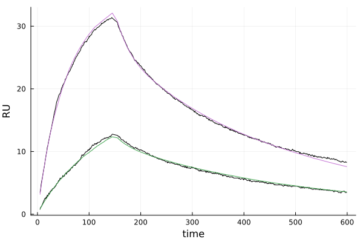

# Fitting to SPR Data
In this tutorial we will illustrate how to fit the surrogate model to SPR data to estimate $k_{\text{on}}$, $k_{\text{off}}$, $k_{\on,b}
serial on any computer, and our workflow for building large surrogates on
clusters (specific to the Grid Engine queuing system based cluster we use).

## Setup
We begin by installing the packages we need in a clean environment:
```julia
using Pkg

# create a new environment for the surrogate constructions
Pkg.activate("fitting_env") 
Pkg.add(url="https://github.com/isaacsas/SPRFittingPaper2023.jl.git")
```

## Estimating Best Fit Parameters to an SPR Dataset
We wil work with the same SPR dataset as in the [Forward Model Simulation](@ref)
tutorial. As described in [1], our general approach will be to use the XNES
optimizer from BlackBoxOptim.jl to minimize the difference between the SPR data
and the surrogate's predicted SPR traces. XNES is a stochastic natural evolution
optimizer that we have found often gives the best fits among many optimizer
choices. We use this optimizer via Optimization.jl, which allows for the easy
selection of different optimizer choices. As XNES is stochastic, we will run the
parameter estimation process `nfits` times, and select parameters from the run
with the minimal loss as our final estimates. 

We'll use the full surrogate from [1], which can be downloaded
[here](https://doi.org/10.6084/m9.figshare.26936854).

We being by defining some variables related to the fitting process:
```julia
nfits = 100    # how many fits to run and then take the minimum over
nsims = 250    # number of simulations to average when plotting
logCP_optrange = (1.0, 5.0)  # allowable log-space range of CP values 
```

Next we set the location of the surrogate:
```julia
surfile = "PATH_TO_DOWNLOADED_SURROGATE.jld"
```

We are now load the surrogate and SPR data:
```julia
# load the surrogate
surrogate = Surrogate(surfile)
sps = surrogate.surpars

# range of CP values to use
optpar_ranges = [logCP_optrange]

# load the aligned SPR data from input CSV file
datadir = joinpath(@__DIR__, "..", "..", "data")
aligned_data_fname = joinpath(datadir, "Data_FC4_10-05-22_Protein07_FD-11A_RBD-13.8_aligned.csv")
aligneddat = get_aligned_data(aligned_data_fname)
```
Finally, we now run the optimizer `nfits` times, taking as our parameter estimates the fit with the mimimal loss:
```julia
optsol, best_pars = fit_spr_data(surrogate, aligneddat, optpar_ranges)
for i in 2:nfits
    optsol_new, best_pars_new = fit_spr_data(surrogate, aligneddat, optpar_ranges)
    if optsol_new.minimum < optsol.minimum
        optsol = optsol_new
        best_pars = best_pars_new
    end
end
```
We find the best fit parameters, `[kon, koff, konb, reach, CP]`, are
```julia
best_pars = [5.2859956892261876e-5, 0.04086857480653136, 0.7801815024260655, 31.898843844047246, 128.56923492479402]
```
We can now plot (and output) a figure comparing our fits to the SPR data
```julia
# number of simulations to average over in making the plot
simpars.nsims = nsims

# save a figure showing the fit to the SPR data
OUTDIR = tempdir()
figfile = joinpath(OUTDIR, "fit_curves.png")
visualisefit(optsol, aligneddat, surrogate, simpars, figfile)
```
Which gives



Here the SPR data is shown in black and the average predicted responses in
color. Finally, we can save a spreadsheet with our fits and parameter estimates
via
```julia
curvefile = joinpath(OUTDIR, "parameters.xlsx")
savefit(optsol, aligneddat, surrogate, simpars, curvefile)
```
For this example the file [here](./fitting_data/parameters.xlsx_fit.xlsx) shows
the resulting Excel spreadsheet. Note that the second sheet within it shows the
parameter estimates.

## General Workflow 
A more detailed workflow that processes multiple SPR inputs, includes monovalent
fits, and systematically writes output files for each fit can be downloaded
[here](./fitting_workflow/Fitting_Examples.zip). This file contains three
sub-folders:

1. *Experiments* contains a set of CSVs corresponding to processed SPR
   experiments for fitting.
2. *Code* contains a file "readme.md" with instructions on how to use/modify the
   included "ParameterFitting_Example.jl" script to fit a collection of
   experiments.
3. *Surrogates* is where you should place the downloaded surrogate from the
   manuscript, which is available
   [here](https://doi.org/10.6084/m9.figshare.26936854) (or place whatever
   surrogate you wish to use).

## Bibliography
1. A. Huhn, D. Nissley, ..., C. M. Deane, S. A. Isaacson, and O. Dushek,
   *Analysis of emergent bivalent antibody binding identifies the molecular
   reach as a critical determinant of SARS-CoV-2 neutralisation potency*, in
   review, [available on bioRxiv](https://www.biorxiv.org/content/10.1101/2023.09.06.556503v2) (2024).